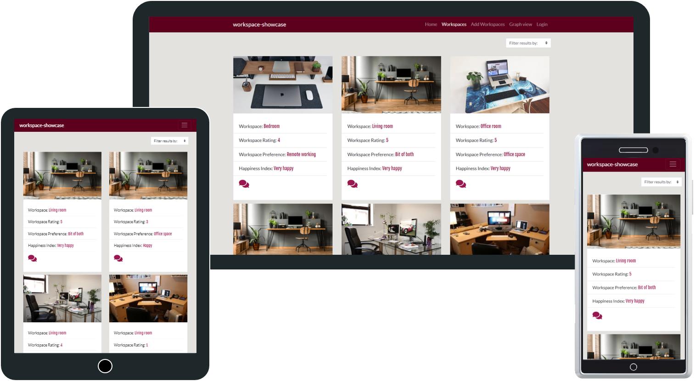
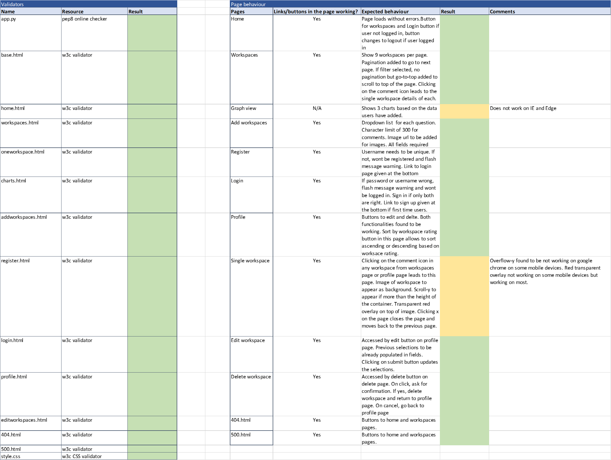

<h2>workspace-showcase</h2>

# workspace-showcase

The huge disruption in our work caused by Covid-19 changed the way we work from office setting to remote working. 
This is my third milestone project in full stack web developement at code institute. For this project, I used the changing work style as inspiration
where users can post their current remote workspace or their preferred workspace and compare with others. 

You can find the deployed site [here](http://workspace-showcase.herokuapp.com/)

## UX

### User stories

- I am very happy that I am able to work from the comfort of my home, I have a good setup but it might not be the same for all. 
It would be interesting to see the different work areas 
- Though I am happy with my work setup, I would like to have some direct interaction with people. I wonder what others think of this  
- This is extremely stressful, I would like to see how happy others are with the situation 
- It would be nice to have a visual comparison which shows the happiness levels of different people with their work setups

### Strategy

The idea of the project is to compare the workspaces of different users to understand how the different work settings affect different individuals.
Based on details provide by the users, it should be easy to assess or compare the overall stress level or happiness which could be considered a crucial factor in mental health.
It also aims at understanding how users would like to work in the future whether it would be in an office setting or remote or a balance of both. 

### Scope

As someone working away from office at the moment, though I am mostly happy with my setup I sometimes get stressed but it might not be same for all.
To understand what areas to include in the site, I talked to a few colleagues and friends in the similar situation. 
Based on the input and user stories, I identified key areas to include in a workspace user insert in the site. 
1. Workspace room or setup
2. How they would rate that particular workspace
3. Would they prefer working working from office, remote working or bit of both
4. How happy they are or would be with that particular workspace
5. Additional comments 
6. Graph for easy visual comparison to find the stress or happiness levels

### Structure

There are 7 main pages, login and registration pages, and two error handling pages. Other than these, there is a base page which serves as the base for all the other pages. This page includes the navbar and other elements which are same in all the other pages. 

#### The home page
The home page gives brief introduction about the site. It has two buttons - View workspaces and Login. View workspaces takes the user to the workspaces page and the login to the login page. 

#### Workspaces page

This page showcases all the workspaces added in by all users. All the details except for the comments is shown in each workspace. This serves as a quick look of each workspace. When clicked on the comment icon in each workspace, it takes to the detailed view of that particular workspace which has the image as background and also includes the comments along with the other details. Users can then exit out of this by clicking on the close button.  
Pagination is added in the workspaces page so that all the results are not shown in one page. Only 9 results are shown per page.  
This page includes a filter dropdown where they can filter the results by the workspace room. With this, only the results with the selected workspace room are returned. There is no pagination for the filtered results but scroll-to-top feature is added to scroll to the top.  

#### Add Workspaces page

User needs to be logged in to access this page. If user is not logged in, it takes them to the login page.  
This page has form with 5 fields. These fields are used to populate the workspaces.  
I have used defensive design where users are given the choice to select only those in the list of dropdown. To avoid huge paragraphs as comments, the number of characters are limited to 300 characters. 
For the image field, user needs to enter the image url. Users are given the option to upload the image to 'https://postimages.org/' and get 'Direct link' url to paste in this field. If they are uncomfortable in doing so, they can copy the url of a similar looking image from the web. Since the image acts only as a secondary source for the purpose of this site, it does not make a huge impact even if they don't enter their exact image.  
Once user clicks submit, it creates a new workspace with the details provided and takes them to their profile page. 

### My profile page

User needs to be logged in to access this page. This page has all the workspaces added by the user. The UI is similar to the workspaces page. This page includes a sort button which provides the option to sort by the rating they have given for their workspaces. This could helpe a user make a comparison with their own workspace setups. 

### Graph view

This page shows 3 graphs which helps in a visual comparison.  
Graph 1 shows the overall happiness index. It is a donut chart which splits the happiness index based on the count of users' selection of happiness or stress when they added the workspaces.  
Graph 2 shows the workspace preference as a donut chart. This shows a quick view into users' preference in working from office, remote or bit of both.  
Graph 3 shows the happiness index and the type of workspace room. This serves as a tool to compare the happiness index with different workspace setups. 

### Login/Registration

These pages are for users to register or login. The login link in navbar takes them to the login page but if they dont have an existing account, they can click on the link below to go to the register page. 

### Skeleton

The schema for the website with mongodb can be found [here](/wireframes/schema.pdf). You can see the wireframes saved as pdf below:

[Wireframe for desktop](/wireframes/Wireframe_desktop.pdf) 
[Wireframe for tablet](/wireframes/Wireframe_tablet.pdf) 
[Wireframe for mobile](/wireframes/Wireframe_mobile.pdf)

### Surface

The website is created in an easily navigatable manner with sections added in the navbar. When user is not logged in, it includes Home, Workspaces, Add workspaces, Graph view and Login. When the user is logged in, a new link appears for My Profile and Login link turns to Logout.  
The website is using a clean, minimalistic approach where light color is used in the background and shades of red are used for buttons and highlight. White is used for content areas. Icons are used only where it serves a purpose like the comment icon to take to the single workspace. The single workspace page takes the workspace image as a background overlayed by dark red which has other details.  

The color scheme followed are:

-  `#5D001E` 
-  `#E3E2DF`
-  `#E3AFBC`
-  `#9A1750`
-  `#9A1750`

The fonts used are Fjalla One and Noto Sans

### Existing Features
1. Responsive layout: Site is accessable and scalable across devices
2. Registration: Users can register with a username and password. Username has to be unique to avoid duplicates. 
3. Login: Users register can login using their registered username and password
4. Encrypted password: Password is hashed and encrypted using a Python library Bcrypt. Only the encrypted password is accessable in the database. 
5. Profile page: Logged in users can access their own profile page which has the workspaces they have added
6. CRUD: Anyone can view the workspaces but to insert, edit and delete the workspaces they need to be logged in. Users can make these changes only on the workspaces added by them which are available in their profile page. 
7. Pagination: Only 9 results available per page but users can go to next or previous using the pagination feature. 
8. Filter: Users can filter the result by using the filter available in the workspaces page. Pagination is not available when filtered. 
9. Scroll to top: By clicking on the icon to go to the top, users can go to the top of the page instead of scrolling all the way. 
8. Charts: Charts are automatically updated based on the data uploaded by users. It takes some time to reflect the change but still a nice feature for the purpose of the website. One thing noticed is that the charts are not viewable in Internet Explorer and Edge. 

### Features Left to Implement
- Pagination for filtered results
- Sort by rating to be added on workspaces pages as well
- User ability to edit and delete their profile

## Technologies Used

HTML  
CSS  
Google fonts  
Bootstrap  
Javascript/jQuery used as part of Bootstrap and also for few other functions  
Python 3 to create the app, create the routes, create the functions within those routes and all back end interactions. 
Flask framework to create and populate the templates 
MongoDB Atlas used as a backend framework. 
Heroku: The cloud based platform is used for deployment of the site. 

## Testing

Every new code was tested by running the app wiht the debugger on. If any routes did not work, the debugger would catch that. 
I used an [Excel](testing/Testing.png) to update my testing. 
I have pasted a screenshot of that below. 

#### Links tested
All the links in the site have been tested manually and found to be working successfully.   I used an [Excel](testing/Testing.xlsx) to update my testing. 
I have pasted a screenshot of that below. 

#### Validations
Validated html and css with W3C validator and Python Flask with pep8 online checker.

### Noted errors and bugs

An initial idea was to add pagination for the filtered results as well in the workspaces page but the pagination next and previous buttons were returning all the results instead of the filtered results. Tried adding the filter to the 'get workspaces' route and adding that as a session instead of keeping that as a separate route 'filter'. This worked to some extent but the filtered results were returning in the next page only if the selection was made a second time.
As a workaround for now, I removed pagination for the filtered results but added scroll-to-top feature. 

#### Responsiveness and browser compatibility

The website is created to be responsive, the way the results appear is different in mobile, tablet and desktop. Found that Overflow-y to be not working on google chrome on some mobile devices, seems to be a bug with the Chrome version installed in that particular device. Works with all other browsers. Red transparent overlay not working on some mobile devices but working on most.  
Charts does not appear on IE and Edge but works with all the other browsers.  
Tested across multiple devices using devices directly where available and by using https://www.browserstack.com/ for others.  

#### Browser compatibility

